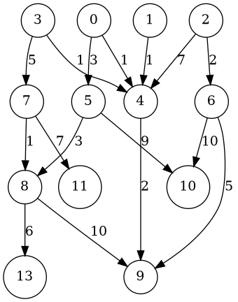
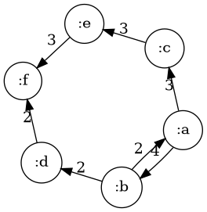
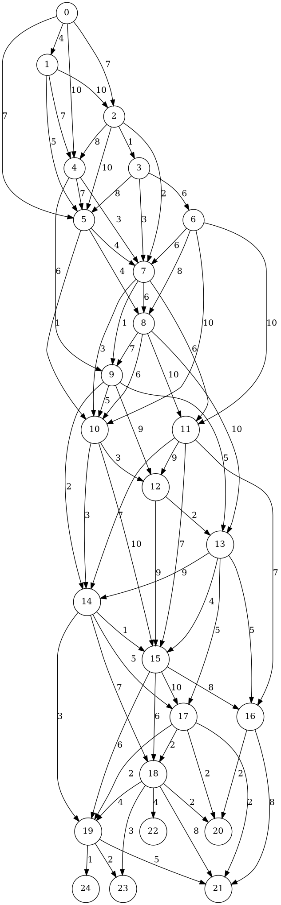
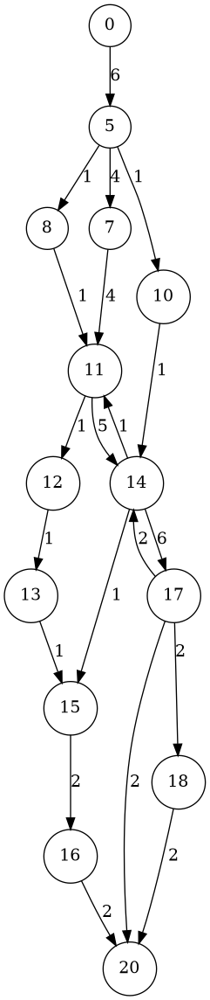

## Description of the problem

Today, I am going to write about [Ford-Fulkerson
Algorithm](https://en.wikipedia.org/wiki/Ford%E2%80%93Fulkerson_algorithm).
I wrote about this
[earlier](https://kaygun.tumblr.com/post/103320427534/an-implementation-of-ford-fulkerson-algorithm-in),
but that post was in Common Lisp. Plus, I am going to go over the
theory slightly deeper than my original post, and write a new
implemention in Clojure. I also [posted the text and the
code](https://github.com/kaygun/ford-fulkerson) for this post on my
github.

## Weighted Simple Directed Graphs 

We have a weighted simple directed graph $G = (V,E,w)$
where $V$ is a finite set of vertices, $E\subseteq V\times V$ is
the set of edges and $w\colon E\to [0,\infty)$ is the weight 
function.  Here is an example:


## Augmenting Subgraphs

I will call a weighted simple directed graph $G'=(V',E',w')$ an 
*augmenting subgraph of $G$* if

1. $G'=(V',E')$ is a subgraph of $G$,
3. $w'(a,b)\leq w(a,b)$ for every $(a,b)\in E'$, and
4. $\sum_{(c,a)\in E'} w'(c,a) = \sum_{(a,b)\in E'} w'(a,b)$ for every 
$a\in V'$ which is neither a source nor a sink.

The last condition says in the subgraph, the total weights of incoming
edges at a vertex is equal to the total weight of the outgoing edges
on the same vertex.  With these conditions at hand, notice that a weighted
simple directed graph need not be an augmented subgraph of itself, as in
our example above.

Here is an example of an augmenting subgraph:

 

Notice that any path in $G$ gives us an augmenting subgraph if we set the
weights of each of the edges to the minimal weight along the path.  For 
example the path $acef$ with all weights equal to $3$ is an augmenting path.

## Residual Subgraph

If $G=(V,E,w)$ is a weighted simple directed graph and if $G'=(V',E',w')$
is an augmented graph, the residual graph (which we denote by $G\setminus G'$ is the
graph $(V,E, w'')$ where the weight function $w''$ is defined as

$$ w''(a,b) = 
   \begin{cases}
     w(a,b) - w'(a,b) & \text{ if } (a,b)\in E'\\
     w(b,a) + w'(a,b) & \text{ if } (a,b)\in E' \text{ and } (b,a)\in E\\
     w'(b,a) & \text{ if } (a,b)\in E' \text{ but } (b,a)\notin E
   \end{cases}
$$

In order to simplify the computation, let us set the weight of all nonexistent edges to
0. Then the new weight matrix is going to be
  
$$ w''(a,b) = 
   \begin{cases}
     w(a,b) - w'(a,b) & \text{ if } (a,b)\in E'\\
     w(a,b) + w'(b,a) & \text{ if } (b,a)\in E'
   \end{cases}
$$

With this definition at hand, for the graph and the augmenting subgraph we gave above
the residual graph is going to be


## The Poset of Augmenting Subgraphs

There is a partial order on the set of all augmenting subgraphs
of a given weighted simple directed graph.  So, if $G'=(V',E',w')$
and $G''=(V'',E'',w'')$ are two such graphs then we say $G'\leq G''$
if $G'$ is a subgraph of $G''$ and we have $w'(a,b)\leq w''(a,b)$
for every $(a,b)\in E'$.

With this definition at hand, now we can talk about *maximal augmented subgraphs*.
Here are two such maximal augmented subgraphs which (necessarily) are incomparable:

 

## Flow Along an Augmenting Subgraph

Given an augmenting subgraph $G'=(V',E',w')$ we define the total flow as

$$ Flow(G')
   = \sum_{s\in Sink(G')} \sum_{(a,s)\in E'} w'(a,s)
   = \sum_{s\in Source(G')} \sum_{(s,a)\in E'} w'(s,a)
$$

Notice that even though both augmenting subgraphs example above are maximal with respect to 
the partial order we defined above, the total flow from the source to sink are different.

## Maximal Augmenting Subgraphs with Maximal Flow

So, we can now talk about a maximal augmenting subgraph with maximal flow.  If 
$F$ is the weight function  of the maximal augmenting subgraph with maximal flow 
then one can define it recursively as

$$ F(G) = F(G\setminus S) + w_S $$

for an augmenting subgraph $S$ of $G$ where $w_S$ is the weight function of the
augmenting subgraph $S$. The base case is that $F(G)$ is uniform weight function 0 
if $G$ has no augmenting subgraphs. 

The [Ford-Fulkerson
Algorithm](https://en.wikipedia.org/wiki/Ford%E2%80%93Fulkerson_algorithm)
finds the weight function of maximal augmenting subgraph with maximal
flow using this recursive formula with augmenting paths for $S$.

## An Implementation in Clojure

#'user/dot-file

I will represent a weighted simple graph as a hashmap of pairs of vertices:
```clojure
(def G {[:a :b] 4 [:a :c] 6 [:b :d] 2 [:d :c] 1 
        [:d :f] 2 [:c :e] 3 [:e :f] 3})
```
```clojure
#'user/G
```


Here is an augmenting subgraph:
```clojure
(def S {[:a :b] 2 [:b :d] 2 [:a :c] 3
        [:d :f] 2 [:c :e] 3 [:e :f] 3})
```
```clojure
#'user/S
```


Next, we need a function that returns a residual graph for a weighted simple
directed graph and an augmenting subgraph:
```clojure
(defn residual-graph [G S]
   (->> (mapcat (fn [[k v]] {k (- v) (reverse k) v}) S)
        (into {})
        (merge-with + G)
        (filter (fn [[k v]] (> v 0)))
        (into {})))
```
```clojure
#'user/residual-graph
```
Let us test
```clojure
(def RG (residual-graph G S))
RG
```
```clojure
#'user/RG
{(:b :a) 2, (:c :a) 3, (:f :e) 3, [:a :b] 2, (:f :d) 2, [:a :c] 3, [:d :c] 1, (:e :c) 3, (:d :b) 2}
```


Next, a depth-first search function to find an augmenting path between two 
vertices:
```clojure
(defn find-a-path [G a b]
  (loop [H G
         x a
         P []]
    (let [ys (->> (keys H) (filter (fn [[u v]] (= u x))))]
      (cond (or (empty? H) (nil? x)) []
            (contains? (into #{} ys) [x b]) (reverse (cons [x b] P))
            (empty? ys) (recur (dissoc H (first P)) (-> P first first) (rest P))
            :true (recur (dissoc H (first ys)) (-> ys first second) (cons (first ys) P))))))
```
```clojure
#'user/find-a-path
```
Let us test this function. First a random graph:
```clojure
(defn get-random-graph [n m k w]
  (->> (range n)
       (mapcat (fn [i] (repeatedly m (fn [] [i (+ 1 i (rand-int k))]))))
       distinct
       (mapcat (fn [x] {x (+ 1 (rand-int w))}))
       (into {})))

(def random-graph (get-random-graph 9 2 5 10))
random-graph
```
```clojure
#'user/get-random-graph
#'user/random-graph
{[8 9] 5, [3 4] 6, [8 10] 3, [4 9] 9, [1 4] 7, [5 7] 4, [4 8] 10, [1 5] 1, [5 6] 2, [6 11] 3, [2 7] 8, [3 6] 8, [7 10] 10, [0 2] 10, [6 10] 6, [2 6] 9}
```


```clojure
(into [] (find-a-path random-graph 0 9))
(find-a-path random-graph 8 0)
```
```clojure
[]
[]
```

Finally, our implementation of Ford-Fulkerson:
```clojure
(defn ford-fulkerson [G a b]
   (loop [H G S {}]
     (let [R (find-a-path H a b)]
       (if (empty? R)
         (into {} S)
         (let [v (reduce min (map H R))
               P (zipmap R (repeat v))]
           (recur (residual-graph H P) (merge-with + S P)))))))
```
```clojure
#'user/ford-fulkerson
```
Let us test this on the graph we defined above:
```clojure
(ford-fulkerson G :a :f)
```
```clojure
{[:a :b] 4, [:b :d] 2, [:d :f] 2, (:b :a) 2, [:a :c] 3, [:c :e] 3, [:e :f] 3}
```



Let us look find an augmenting suggraph on a different large random-graph
```clojure
(def random-graph (get-random-graph 20 5 5 10))
random-graph
```
```clojure
#'user/random-graph
{[8 11] 3, [16 19] 5, [7 12] 1, [18 23] 5, [13 15] 9, [7 11] 9, [10 15] 5, [2 5] 9, [15 16] 9, [10 13] 7, [15 19] 7, [6 7] 9, [12 13] 7, [5 10] 5, [0 5] 3, [3 4] 10, [19 24] 5, [11 14] 5, [19 22] 1, [18 19] 4, [7 8] 7, [8 10] 6, [14 19] 4, [9 12] 2, [4 9] 3, [15 20] 5, [4 6] 4, [11 12] 10, [1 3] 2, [4 8] 1, [10 11] 1, [5 6] 9, [5 8] 3, [16 18] 2, [8 13] 5, [9 11] 2, [6 11] 7, [10 12] 8, [2 7] 10, [13 17] 3, [2 4] 4, [12 15] 1, [0 2] 6, [6 9] 9, [11 15] 5, [19 21] 3, [0 4] 3, [14 18] 4, [9 13] 6, [13 16] 7, [13 18] 2, [6 10] 10, [14 16] 4, [1 6] 7, [16 20] 6, [18 21] 6, [2 6] 10, [8 12] 3, [12 16] 4, [1 2] 4, [18 20] 4, [3 5] 4, [17 22] 9, [11 16] 3, [0 1] 2, [17 20] 4}
```



```clojure
(def augmenting-subgraph (ford-fulkerson random-graph 0 20))
augmenting-subgraph
```
```clojure
#'user/augmenting-subgraph
{(7 6) 8, [8 11] 4, [7 12] 1, (10 5) 4, [13 15] 7, (11 9) 3, (4 3) 2, [7 11] 2, [10 15] 3, [2 5] 8, [15 16] 5, [6 7] 9, [12 13] 6, [5 10] 6, [0 5] 8, [3 4] 3, [11 14] 8, [8 10] 1, [9 12] 2, [4 9] 3, (6 5) 7, [15 20] 5, (5 2) 4, [4 6] 2, (11 8) 2, [11 12] 3, [1 3] 2, (6 4) 1, [5 6] 9, [5 8] 3, (14 11) 4, [9 11] 3, [6 11] 3, [2 7] 2, [0 2] 6, [0 4] 3, [14 18] 4, [9 13] 1, (3 1) 1, [1 6] 1, [16 20] 5, (5 0) 5, [18 20] 4, [0 1] 2}
```



Let me simplify the output by removing spurious feedback loops:
```clojure
(defn clean [G]
  (let [ks (into #{} (keys G))
        H (->> (map reverse ks)
               (filter ks)
               (mapcat (fn [k] (let [v0 (G k) v1 (G (reverse k))]
                                   (if (> v0 v1)
                                       {k (- v0 v1)}
                                       {(reverse k) (- v1 v0)}))))
               (into {}))]
      (as-> (map reverse (keys H)) $
            (concat (keys H) $)
            (into [] $)
            (merge (apply dissoc G $) H)
            (filter (fn [[k v]] (> v 0)) $))))
  
(def cleaned (clean augmenting-subgraph))
```
```clojure
#'user/clean
#'user/cleaned
```


So, here is the final version of mu implementation of the Ford-Fulkerson
algorithm to find a maximal augmenting subgraph with maximal flow:
```clojure
(defn ford-fulkerson [G a b]
   (loop [H G S {}]
     (let [R (find-a-path H a b)]
       (if (empty? R)
         (into {} (clean S))
         (let [v (reduce min (map H R))
               P (zipmap R (repeat v))]
           (recur (residual-graph H P) (merge-with + S P)))))))
```
```clojure
#'user/ford-fulkerson
```
and a final test:
```clojure
(= (into {} cleaned)
   (ford-fulkerson random-graph 0 20))
```
```clojure
true
```